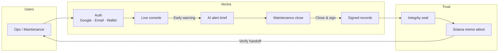
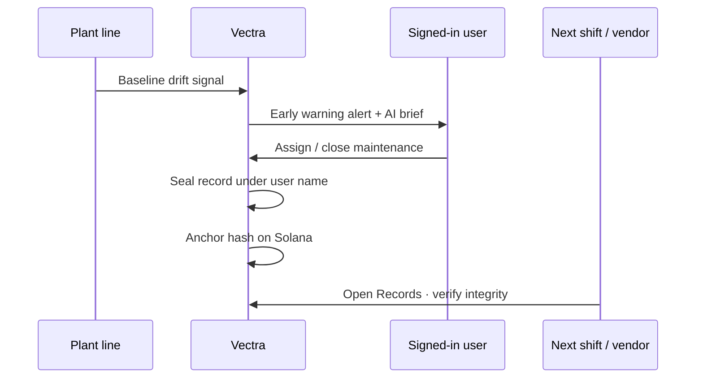

<p align="center">
  
</p>

<h1 align="center">Vectra</h1>

<p align="center">
  <strong>Industrial Monitoring</strong><br />
  Downtime response and signed shift handoffs for manufacturing plants.
</p>

<p align="center">
  
  
  
  
</p>

<p align="center">
  <a href="https://vectra.sithunyein.com"><strong>Live product →</strong></a>
  ·
  <a href="https://vectra.sithunyein.com/login">Sign in</a>
</p>

---

## Who it's for

**Ops Leads, Maintenance Supervisors, and night-shift teams** at manufacturing plants — SMT, assembly, packaging — who need to act on line faults in minutes and leave signed handoffs vendors can verify.

## Why Vectra

Plant teams lose time when downtime is found late and handoffs live in chat threads. Vectra gives Ops and Maintenance one console to:

- Catch **early warnings** from line baseline drift  
- Draft an **AI brief** (symptom, likely cause, next action) — humans still decide  
- Close jobs with reason codes under a signed-in identity  
- Seal **integrity records** and **attest on Solana** so the next shift can verify  

Sign in with **Google**, work email, or wallet. New workspaces start empty — import your plant via **Excel/CSV**, connect lines as telemetry comes online, or load example data for a walkthrough.

## Architecture



## Product loop



## Features

| Area | What you get |
|------|----------------|
| Overview | Shift board, KPIs, open critical alerts |
| Devices | Machine and line status |
| Alerts | Acknowledge, assign, resolve · early warning · **AI brief** |
| Analytics | Efficiency, energy, downtime views |
| Maintenance | Close with reason · seals a record |
| Records | Signed handoffs · integrity check · **Solana proof link** |
| Reports | Weekly CSV export |
| Settings | Plant identity, **Excel/CSV import**, theme, example dataset |

## Stack

- **App:** Next.js · TypeScript · Tailwind · Recharts · Framer Motion  
- **Auth:** Supabase Auth (Google OAuth + email/password + wallet)  
- **AI:** OpenAI alert briefs (deterministic fallback)  
- **Web3:** Solana memo attestation on record close  
- **Deploy:** Vercel · [vectra.sithunyein.com](https://vectra.sithunyein.com)

## Quick start

```bash
git clone https://github.com/thesithunyein/vectra.git
cd vectra
npm install
cp .env.example .env.local   # if present; or set vars below
npm run dev
```

Required env:

```bash
NEXT_PUBLIC_APP_NAME=Vectra
NEXT_PUBLIC_APP_URL=http://localhost:3000
NEXT_PUBLIC_SUPABASE_URL=...
NEXT_PUBLIC_SUPABASE_ANON_KEY=...
OPENAI_API_KEY=...                 # server only — AI briefs
SOLANA_SECRET_KEY=[...]            # server only — JSON byte array keypair
NEXT_PUBLIC_SOLANA_CLUSTER=devnet
```

Fund the Solana attestation wallet on [devnet faucet](https://faucet.solana.com) before closing maintenance records.

Auth setup: [docs/AUTH_SETUP.md](docs/AUTH_SETUP.md)

## Links

| | |
|--|--|
| **Live product** | https://vectra.sithunyein.com |
| **Repository** | https://github.com/thesithunyein/vectra |

## Brand

- **Name:** Vectra  
- **Subtitle:** Industrial Monitoring  
- **Tagline:** Downtime response and signed shift handoffs  
- **Mark:** `public/logo.png`  
- **Accent:** `#0066FF`
